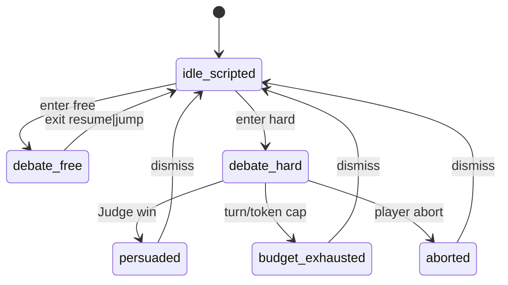

# Debate UX — DebateSession on Venue2D（CN 友好线框）

Status: **Design · Spec v3 companion** · 2026-09-07 · **no runtime code**  
SoT 导演：[`DEBATE_SCHEME_V3.md`](./DEBATE_SCHEME_V3.md) · 架构：[`DEBATE_ARCHITECTURE.md`](./DEBATE_ARCHITECTURE.md) · BFF：[`adr/0003-debate-bff.md`](./adr/0003-debate-bff.md)  
UI 皮：[`UI_GATE.md`](./UI_GATE.md)（羊皮纸对话框 / 名牌 / 演绎角标）

> 本文 = Venue2D 上 **DebateSession** 的组件清单与线框。`debateMode`: `scripted` | `free` | `hard`（勿与壳模式撞名）。

---

## 0. 组件总览

| 组件 | 出现模式 | 说明 |
|---|---|---|
| Mode entry（城市页 picker + 场所 ⋯） | 全模式入口 | 解锁徽章；Hard 建议 ≥1 Infinitas |
| DebateSession modal overlay | free / hard | 进入时 **pause** scripted `beatIndex` |
| Dialogue strip + cite chips | free / hard（scripted 沿用既有皮） | 徽章：事实 / 时代观点 / 演绎 |
| EvidenceBoard 侧栏 | hard 真填；free = **ghost only** | 羊皮纸 · 六槽 |
| Watson multiline essay composer | hard | 长文反驳口；可 propose 多槽 |
| Propose-fill sheet | hard | 选 Fact / lab readout → 槽 |
| Stance Critic challenge toast / line | hard | **无脸 / 无剪影立绘**（默认 stance） |
| Outcome copy | hard 结束 | `persuaded` / `budget_exhausted` / `aborted` |

---

## 1. Mode entry

### 1.1 城市页 picker

```
┌─ CityPage · Manchester ─────────────────────┐
│  [图志]  [进入场所]                           │
│                                              │
│  辩论模式                                     │
│  ┌────────┐ ┌────────┐ ┌────────┐           │
│  │ 常规   │ │ 自由   │ │ Hard   │           │
│  │scripted│ │ free   │ │证据槽  │           │
│  │  ✓     │ │ 🔒/✓   │ │ 🔒/✓   │           │
│  └────────┘ └────────┘ └────────┘           │
│  徽章：自由解锁 / Hard 解锁（≥1 labEmbed）    │
└──────────────────────────────────────────────┘
```

- **常规** 默认进 Venue2D scripted（无 modal）。
- **自由 / Hard** 进 Venue2D 后立刻挂 DebateSession overlay（或先进场所再从 ⋯ 开）。

### 1.2 场所 ⋯ 菜单

```
Venue2D chrome
  [⋯]
    ├ 返回城市页          ← UI_GATE U2：禁止常驻顶栏返回条
    ├ 辩论 · 自由   (badge)
    └ 辩论 · Hard   (badge)
```

解锁徽章：未解锁 = 锁图标 + 短提示（「完成一次散射实验以解锁 Hard」）；已解锁 = 可点。

---

## 2. Modal overlay lifecycle



| 事件 | 行为 |
|---|---|
| **enter** free\|hard | 冻结 scripted `beatIndex`；dim Venue；挂羊皮纸 modal |
| **exit** | `resume` 原拍 **或** `jump` → `postDebateBeat`（内容 flag） |
| **free** | EvidenceBoard **ghost only** — 断言不 mutate fills |
| **hard** | 真实 fills；Judge → 三态结局文案 |

ASCII 壳：

```
┌──────────────── Venue2D (dimmed) ────────────────┐
│  [busts / lab]                                    │
│  ┌──────── DebateSession (modal) ──────────────┐ │
│  │  namebox │ dialogue strip …  [cite chips]   │ │
│  │─────────────────────────────────────────────│ │
│  │  composer / essay (hard)     │ EvidenceBoard│ │
│  │                               │  (6 slots)  │ │
│  └───────────────────────────────┴─────────────┘ │
└──────────────────────────────────────────────────┘
```

皮遵循 UI_GATE：羊皮纸底 + 墨线边；衬线正文；Ren'Py-style namebox。

---

## 3. Dialogue strip + cite chips

```
┌─ namebox: Rutherford ─────────────────────────┐
│  「大角散射…」                                  │
│  [事实:fact-alpha-large-angle] [演绎]           │
└─────────────────────────────────────────────────┘
```

| 徽章 | 源 | 填槽？ |
|---|---|---|
| **事实** | FactStore cite | ✅（经 CriticPolicy） |
| **时代观点** | EraOpinionStore | ❌ 仅染语气 |
| **演绎** | interpretation / 戏剧许可 | ❌ |

流式（P1b+）：token 进 strip；cite chips **仅在** CriticPolicy 通过或最终 chunk 后贴上（防幻觉中途刷板）。

---

## 4. EvidenceBoard（羊皮纸侧栏 · 6 slots）

参考 `HARD_EVIDENCE_SLOTS_ALPHA.md`；Coupland α = **6 槽**，Judge 胜门槛 **filled ≥ 4** ∧ Critic ≥1 次通过。

```
┌─ 证据板 EvidenceBoard ─────┐
│  S1 [空/填]  S2 [空/填]     │
│  S3 [空/填]  S4 [空/填]     │
│  S5 [空/填]  S6 [空/填]     │
│  已填 2 / 6 · 需 ≥4 且 Critic│
└─────────────────────────────┘
```

| 模式 | 板行为 |
|---|---|
| **hard** | 真实 fill；槽显示 Fact id / lab readout 摘要 |
| **free** | **ghost board only** — 半透明预览可能落入的槽；**永不**写 fills |

点击空槽（hard）→ 打开 Propose-fill sheet。

---

## 5. Watson multiline essay composer（Hard）

```
┌─ Watson · 长文反驳 ─────────────────────────────┐
│  ┌─────────────────────────────────────────────┐ │
│  │（多行）以实验读数与事实卡反驳时代主流理解…    │ │
│  │                                              │ │
│  └─────────────────────────────────────────────┘ │
│  [附带 cite / 提议填槽]              [提交 essay] │
└──────────────────────────────────────────────────┘
```

- 推荐：**1 essay submit = 1 回合**；若 cites 干净可 **propose 多槽**（Critic 逐槽）。
- **长文 alone 不胜** — 必须经 CriticPolicy + 板 fills + Judge。
- namebox 走 Watson；胸微标可选（UI_GATE U3）。

---

## 6. Propose-fill sheet

```
┌─ 提议填入 · Slot S3 ───────────────────────────┐
│  Tab: [Fact 卡]  [实验室读数]                    │
│  ○ fact-…-foil-thickness   Retriever 命中       │
│  ○ labEmbed · scattering_angle ∈ whitelist      │
│  CriticPolicy：cite ⊆ 检索 / 范围 / 非 era_opinion│
│  [取消]                              [填入]     │
└─────────────────────────────────────────────────┘
```

路径与 V3 §3 一致：选 Fact **或** 挂载最近 `labEmbed` → CriticPolicy → fill。Era Critic **不可否决**合法 Fact 填。

---

## 7. Stance Critic challenge（无脸）

默认 `form: stance` — **不要**具名立绘 / 脸 / 剪影半身（P1）。挑战用 toast 或对话行：

```
┌─────────────────────────────────────────────┐
│  时代主流理解 · 挑战                          │
│  「…」（era_opinion cite）[时代观点]          │
└─────────────────────────────────────────────┘
```

可选 P2+ 具名 peer 皮肤另议；非 P1a。

---

## 8. 结局文案（Hard）

| 状态 | CN 文案方向（可改稿） |
|---|---|
| **persuaded** | 「证据板已说服时代主流理解。」— 不改 chroniclePlate / 命运文案 |
| **budget_exhausted** | 「回合（或预算）用尽，今日未能压过时代成见。」— 软失败；可保留 fills（L3） |
| **aborted** | 「辩论中止。」— 回 scripted；fills 按产品策略保留或丢弃 |

Dismiss → resume / jump（见 §2）。**Rutherford ≠ 说服对象** — 文案勿写成「说服了卢瑟福」。

---

## 9. Free = ghost board only

- 可开侧栏预览「若在 Hard，这些 cite 可能落哪槽」。
- UI 水印 / 虚线槽：**预览**。
- 自动化断言：free 路径 `fills` 不变。

---

## 10. 相关

| 文档 | 用途 |
|---|---|
| [`DEBATE_SCHEME_V3.md`](./DEBATE_SCHEME_V3.md) | 导演 SoT（角色 / 填槽 / 生命周期） |
| [`adr/0003-debate-bff.md`](./adr/0003-debate-bff.md) | BFF 落点推荐 |
| [`UI_GATE.md`](./UI_GATE.md) | 羊皮纸 / 导航 / 名牌 / 演绎 |
| [`HARD_EVIDENCE_SLOTS_ALPHA.md`](./HARD_EVIDENCE_SLOTS_ALPHA.md) | 六槽定义 |
| [`HARD_CRITIC_CLAIMS_ALPHA.md`](./HARD_CRITIC_CLAIMS_ALPHA.md) | Critic 主张映射 |
| [`DOCS_INDEX.md`](./DOCS_INDEX.md) | 文档目录 |
